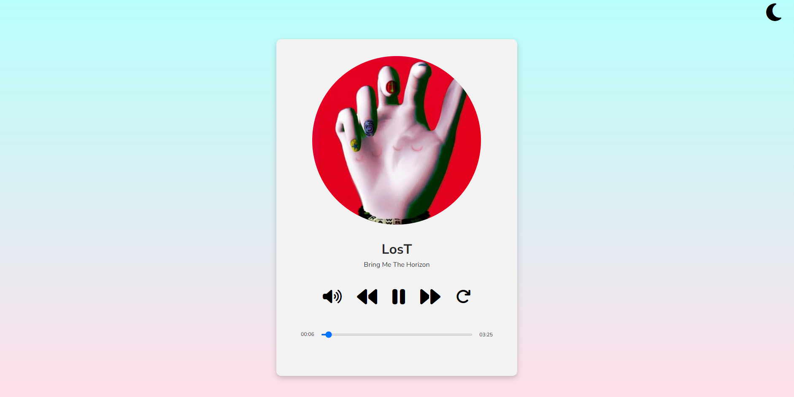
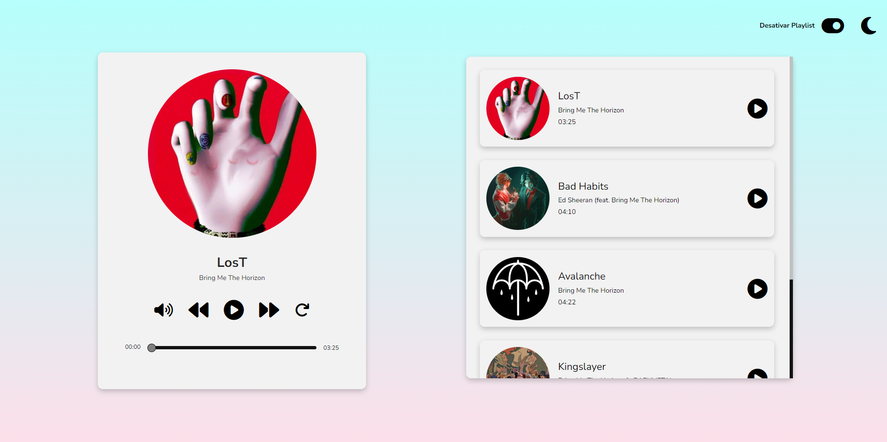
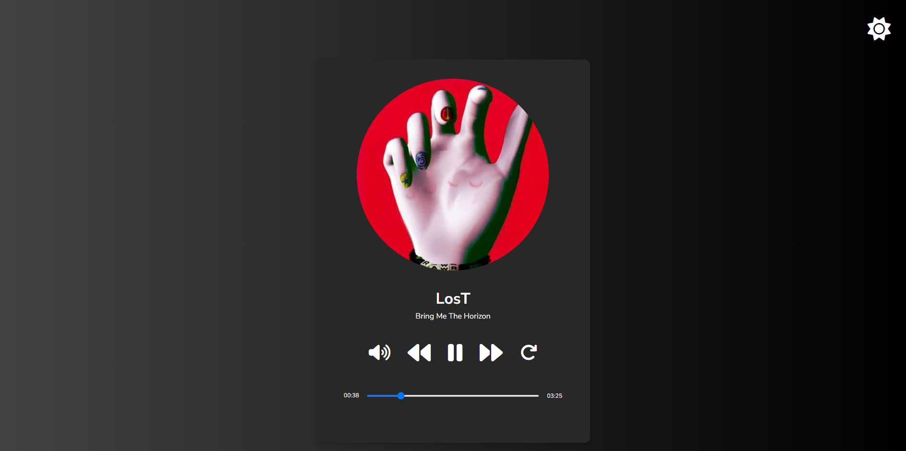
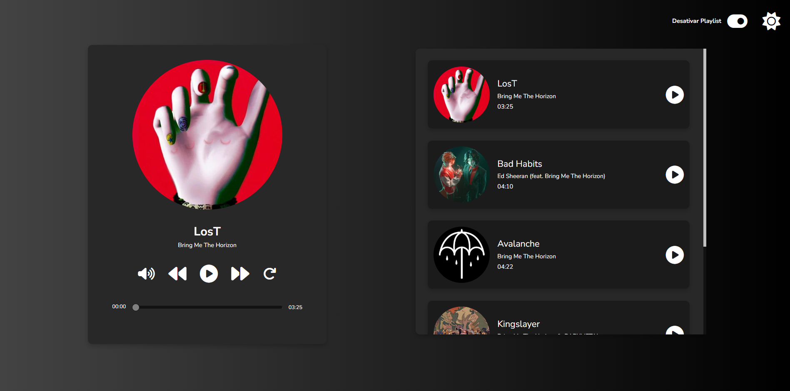

# Music Player ▶️

Projeto "Music Player", tentando criar um player de músicas próprio. 

## Screenshots

## Ferramentas utilizadas

- HTML
- CSS
- JavaScript
- Font Awesome

## Funcionalidades
- Linha do tempo, que permite controlar o tempo atual da música.
- Botões de mute e replay.
- Possibilidade de pular de uma música a outra, de forma totalmente responsiva.
- Dark Mode persistente em todas as páginas com a utilização de localStorage.
- Responsividade Web para todos os tamanhos de tela. 

## Feito por:

Lucas Kenji (dinozindev).

